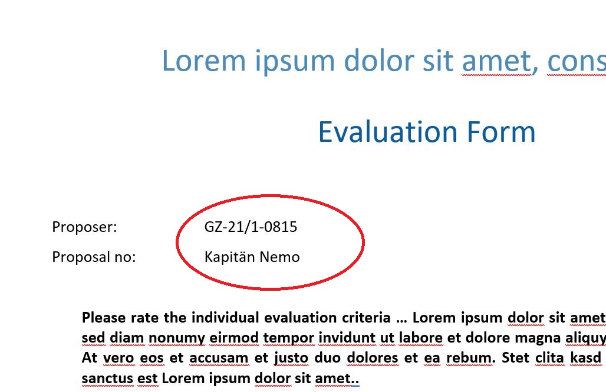

# DFG_Schreibengenerator

<h1>Mini-Beispiel für Schreibenerzeugung anstelle von Formschreiben</h1>

Befüllen einer Vorlagen in Word mit Platzhaltern

<figure>
    
    <figcaption>Vorlage in Word mit MERGEFIELD Feldern</figcaption>
</figure>

<figure>
    
    <figcaption>Erstelltes Dokument mit befüllten Platzhalten</figcaption>
</figure>

<h1>Vorgehen</h1>
<ul>
    <li>Vorlagen werden direkt in Word erstellt. Die Vorlagen enthalten MERGEFIELDS.</li>
    <li>Bei der Schreibenerstellung wählt NeuFA die richtige Vorlage aus und befüllt die Platzhalten durch gültige Werte.</li>
    <li>Das Ergebnisdokument wird im DMS abgelegt.</li>
    <li>Dokumenttyp wird durch das System gesetzt.</li>
</ul>

<h1>Techonlogie</h1>
<ul>
    <li>Standard Microsoft Word</li>
    <li>https://docx4java.org</li>
    <li>Standard Java inkl. XML Parser</li>
</ul>

<h1>Vorteile</h1>
<ul>
    <li>Word-Vorlagen können quasi von jedem erstellt werden.</li>
    <li>Entwicklung kann durch jeden Java-Entwickler erfolgen.</li>
    <li>Minimaler Aufwand</li>
</ul>


<h1>Nachteile</h1>
<ul>
    <li>Aufwand wird in die Entwicklung NeuFA verlagert - nicht mehr Formschreiben-Team.</li>
    <li>Wahrscheinlich nicht geeignet für große Reports bzw. Listen.</li>
</ul>
Für Listen bietet sich eine Technologie wie Jasper Reports an.

<h1>Quick Start</h1>
Voraussetzungen
<ul>
    <li>Java</li>
    <li>Maven</li>
</ul>

```
git clone https://github.com/steffens/DFG_Schreibengenerator.git
cd DFG_Schreibengenerator
mvn clean
mvn install
```
... erzeugt ein Word-Dokument <em>Evaluation_Form_for_Cruise_Proposals_Ergebnis.docx</em>
